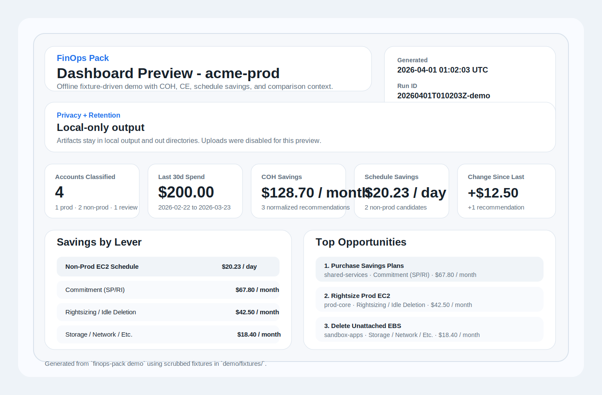

# finops-pack

Lightweight AWS FinOps CLI for cross-account reporting, Cost Optimization Hub exports, schedule
savings estimates, and optional report publishing.



## Quickstart (client)

Install the current release directly from GitHub:

```bash
python -m pip install "git+https://github.com/keabraekman/finops-pack.git@v0.1.0"
```

Create a minimal `config.yaml`:

```yaml
role_arn: arn:aws:iam::123456789012:role/finops-pack-readonly
external_id: replace-me
client_id: my-startup
report_bucket: finops-pack-reports
region: us-east-1
regions:
  - us-east-1
  - us-west-2
schedule:
  timezone: America/New_York
  business_hours:
    days: [mon, tue, wed, thu, fri]
    start_hour: 8
    end_hour: 18
```

Run the report:

```bash
finops-pack run --config config.yaml --collect-ce-resource-daily --check-identity
```

Open:

- `output/dashboard.html` for the operator-local dashboard
- `out/index.html` for the preview bundle
- `output/exports.json`, `output/exports.csv`, and `output/exports.schema.json` for machine-readable exports

## Quickstart (operator)

Clone the repo and install dev dependencies:

```bash
git clone https://github.com/keabraekman/finops-pack.git
cd finops-pack
uv sync --dev
```

Deploy the target role into the customer account:

```bash
aws cloudformation deploy \
  --template-file cfn/readhonly-role.yaml \
  --stack-name finops-pack-readonly \
  --capabilities CAPABILITY_NAMED_IAM \
  --parameter-overrides \
    TrustedAccountId=111122223333 \
    ExternalId=replace-me
```

If you also want the tool to enroll Cost Optimization Hub when needed, add:

```bash
AllowCostOptimizationHubEnrollment=true
```

Validate the trust path:

```bash
uv run finops-pack run \
  --role-arn arn:aws:iam::123456789012:role/finops-pack-readonly \
  --external-id replace-me \
  --check-identity
```

Run the full collection:

```bash
uv run finops-pack run \
  --role-arn arn:aws:iam::123456789012:role/finops-pack-readonly \
  --external-id replace-me \
  --client my-startup \
  --report-bucket finops-pack-reports \
  --collect-ce-resource-daily \
  --enable-coh \
  --rate-limit-safe-mode
```

## Demo Mode

`finops-pack demo` renders the dashboard entirely from scrubbed fixture outputs in `demo/fixtures/`.
No AWS credentials are required.

```bash
uv run finops-pack demo
```

The demo now includes:

- normalized accounts and access report fixtures
- Cost Explorer spend baseline fixtures
- COH summary and export fixtures
- schedule recommendation fixtures
- a preview bundle and a generated `output/exports.schema.json`

## Local Development

Common commands:

```bash
uv run ruff check .
uv run ruff format .
uv run mypy .
uv run pytest
uv build
```

Serve the preview bundle locally:

```bash
cd out
python -m http.server
```

Then open `http://localhost:8000/`.

## What Gets Written

Successful runs and demo mode produce:

- `output/accounts.json`: normalized account inventory and environment classification
- `output/access_report.json`: prerequisite checks, module readiness, and region coverage
- `output/exports.csv`: flattened COH export for spreadsheets
- `output/exports.json`: structured recommendation export
- `output/exports.schema.json`: generated JSON Schema for `exports.json`
- `output/dashboard.html`: primary local dashboard
- `out/summary.json`: diff-friendly totals and comparison data
- `out/index.html`: preview landing page
- `out/report-bundle.zip`: zipped preview bundle
- `out/raw/*.json`: raw CE and COH snapshots when collected
- `out/normalized/recommendations.json`: normalized recommendations used by the dashboard
- `out/schedule/schedule_recs.csv`: non-prod EC2 schedule candidates

When `client_id` and `report_bucket` are set, published artifacts are written under:

```text
s3://<report-bucket>/<client-id>/<run-id>/
```

## Export Schema

The JSON export structure is now documented and generated automatically.

- Schema file: `output/exports.schema.json`
- Field guide: [`docs/exports-json.md`](docs/exports-json.md)

The schema is generated from the same typed model used by the CLI and demo loader, and tests
validate export payloads against that model.

## IAM And Security

Starter IAM templates live in `iam/`:

- `iam/policy-min.json`: default least-privilege baseline for current default CLI behavior
- `iam/policy-full.json`: adds optional Cost Explorer fallback collectors plus COH enrollment

Security and operator notes:

- Permissions, removal steps, threat model, and `ExternalId` rationale:
  [`docs/permissions-explained.md`](docs/permissions-explained.md)
- Private-only report bucket policy example:
  [`docs/private-report-bucket-policy.json`](docs/private-report-bucket-policy.json)

Key points:

- `TrustedAccountId` should be the exact operator or service account that runs `finops-pack`
- `ExternalId` should be unique per client, tenant, or workspace
- report data in S3 should stay private, encrypted at rest, and short-lived
- if you publish reports, scope S3 access to dedicated client prefixes

## Billing Prerequisites

- Use the AWS Organizations management account when you want org-wide billing visibility.
- Cost Optimization Hub must be opted in before recommendations appear.
- Cost Explorer must be enabled before spend baselines and fallback collectors work.
- Cost Explorer resource-level daily data must be enabled before schedule estimates become fully populated.

The dashboard includes `Prerequisites` and `Remediation Steps` sections so missing opt-ins are
surfaced alongside next actions.

## Limitations

- Cost Optimization Hub opt-in is required before COH recommendations appear.
- Cost Explorer resource-level daily data is opt-in and only covers the last 14 completed days.
- COH `recommendationId` values can expire after about 24 hours, so saved IDs should be treated as short-lived.

## CI And Pre-commit

- GitHub Actions CI now runs lint, tests, and a package build on pushes and pull requests.
- `.pre-commit-config.yaml` is included for local formatting and hygiene checks.

Example:

```bash
pre-commit install
pre-commit run --all-files
```

## How To Revoke Access

Delete the CloudFormation stack:

```bash
aws cloudformation delete-stack --stack-name finops-pack-readonly
aws cloudformation wait stack-delete-complete --stack-name finops-pack-readonly
```

If you previously enabled Cost Optimization Hub, opt out first and then remove
`AWSServiceRoleForCostOptimizationHub` if you no longer need it.
